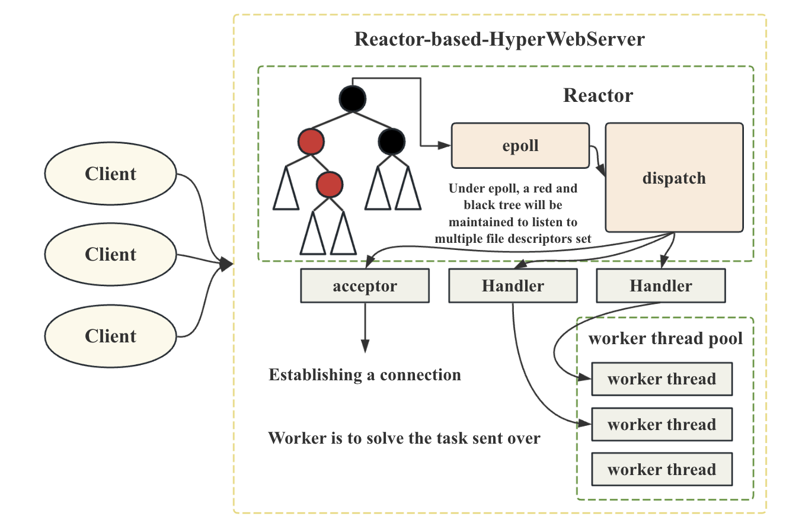

# 基于Reactor的高性能网络服务器

- **[简体中文](./README-CN.md)**
- **[English](./README.md)**

***

- [基于Reactor的高性能网络服务器](#基于reactor的高性能网络服务器)
  - [Reactor服务器整体结构](#reactor服务器整体结构)
  - [项目细节](#项目细节)
    - [epoll\_server](#epoll_server)
    - [reactor\_server](#reactor_server)
  - [项目原理简介](#项目原理简介)

一个基于多路复用Reactor模式的高性能web服务器，底层实现使用epoll模型。

我将继续更新这个项目，继续改进后端和前端的问题，并创建一个完整的项目。到目前为止，该项目已经完成了最基本的后端建设和简单的前端建设。

这个是v2.0版本，在此，在2024年的4月，我对这个项目进行了重新制作，代码进行了一定程度的优化。

**旧版本可以见Release: v1.0**

**其中，epoll在本项目中的基本原理和多路复用高性能IO的基本原理可以在我的其他repo中看到**
**https://github.com/Yufccode/Multiplexing-high-performance-IO-server**

## Reactor服务器整体结构

## 项目细节

项目中实现了两个服务器。

### epoll_server

通过对Linux的epoll特性进行封装，实现了一个基于epoll的网络服务器，这个网络服务器没有进行任何的封装，可以通过telnet对这个服务器进行测试。

**实现细节和代码解释可以见: [work_epoll.md](./docs/work_epoll.md)**

### reactor_server

在多路转接的基础上，对服务器进行进一步封装，增加派发特性实现了reactor模式的web服务器。

- 后端采用epoll的多路转接监听模式
- 用reactor模式进行封装
- 增加web服务器功能，可以分析http请求，构建http相应
- 增加简单的前端页面作为测试

**实现细节和代码解释可以见: [work_reactor.md](./docs/work_reactor.md)**

## 项目原理简介

本项目基于Socker编程，采用epoll形式的多路转接，搭建了一个Reactor模式的网络服务器。

本项目其实是Nginx服务器的核心所在。

关于Nginx等实现原理，异步IO的原理，多路转接的原理，可以见以下链接。

- **[中文-introduction](./docs/introduction-cn.md)**

- **[English-introduction](./docs/introduction.md)**