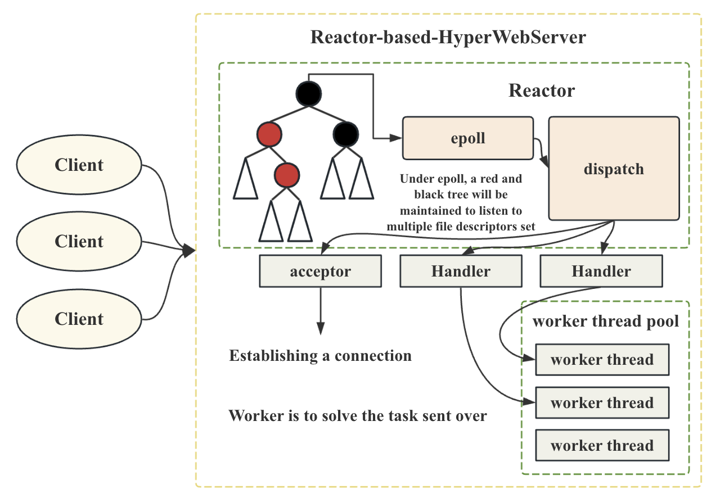
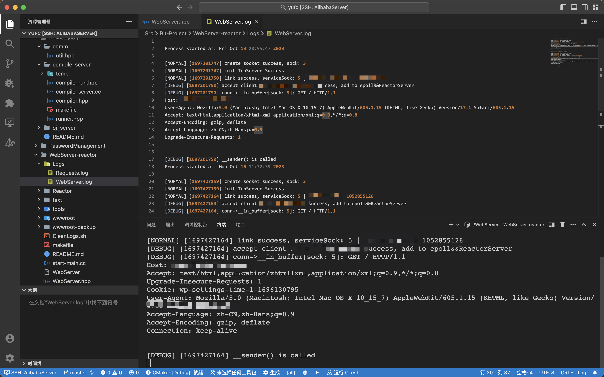

# 基于Reactor的高性能网络服务器

- **[简体中文](./README-CN.md)**

- **[English](./README.md)**

A high-performance web server based on the multiplexed Reactor pattern, with the underlying implementation using the epoll model.

I will continue to update this project, improve the backend and front-end issues, and create a complete project. So far, the project has completed the most basic backend construction and simple frontend construction.

**Among them, the basic principles of epoll in this project and the basic principles of multiplexing high-performance IO can be seen in my other repo:**
**https://github.com/Yufccode/Multiplexing-high-performance-IO-server**

## 0. Overall structure of Reactor server



## 1. Implementation effect


**Backend effects**

Backend effects

In the backend, we can see the obtained HTTP request message in 'stdout', and of course, we can also see the HTTP message in the log file.

**Front end effects**

Display for personal blog.


## 2. operating method

**Env**

- Linux ALiCentos7 3.10.0-1160.88.1.el7.x86_64 #1 SMP Tue Mar 7 15:41:52 UTC 2023 x86_64 x86_64 x86_64 GNU/Linux

- gcc (GCC) 8.3.1 20190311 (Red Hat 8.3.1-3)

clone from github.

```bash
git clone https://github.com/Yufccode/Reactor-based-HyperWebServer.git
```

enter the dir.

```bash
cd Reactor-based-HyperWebServer
```

make.

```bash
make clean;
make;
```

start the sever.

```
./WebServer
```

Note: If running this project on a cloud server, the '8080' port number needs to be opened, otherwise it may be inaccessible due to the firewall.

Open the browser and access the server.

**Local Access**

enter the url。

```url
127.0.0.1:8080
```

**other machines access**

enter the url.

```url
(server ip):8080 # xxx.xxx.xxx.xxx:8080
```

## 3. File Structure

```bash
yufc@ALiCentos7:~/Src/Bit-Project/WebServer-reactor$ tree .
.
├── CleanLogs.sh # Clear all log file content scripts
├── Logs
│   ├── Requests.log # Received the log file saved in the HTTP message
│   └── WebServer.log # Server printed log save file
├── makefile
├── Reactor # Reactor pattern underlying server files
│   ├── Epoll.hpp
│   ├── Log.hpp
│   ├── Protocol.hpp
│   ├── Reactor-server.hpp
│   └── Sock.hpp
├── README.md
├── start-main.cc
├── text
│   └── ziliao.txt # some Reactor pattern underlying server files
├── tools
│   ├── main.cc-backup # main function backup
│   └── ulity.hpp # Tool related interface header files
├── WebServer # executable program
├── WebServer.hpp # Web server header file
├── wwwroot # Front end root directory
│   ├── error
│   │   └── 404.html
│   └── index.html
└── wwwroot-backup # Front end root directory backup
    ├── my_blog_root
    │   └── index.html
    └── wwwroot
        ├── error
        │   └── 404.html
        └── index.html

10 directories, 21 files
yufc@ALiCentos7:~/Src/Bit-Project/WebServer-reactor$
```

## 4. 项目原理简介

This project is based on Docker programming and uses epoll form of multiplexing to build a Reactor mode network server.

Among them, 'WebServer. hpp' is the encapsulation of the underlying 'Reactor' server.

This project is actually the core of Nginx server.

For the implementation principles of Nginx, asynchronous IO, and multiplexing, please refer to the following links.

- **[中文-introduction](./introduction-cn.md)**

- **[English-introduction](./introduction.md)**
